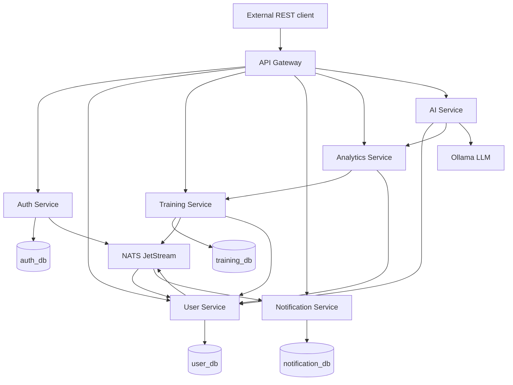
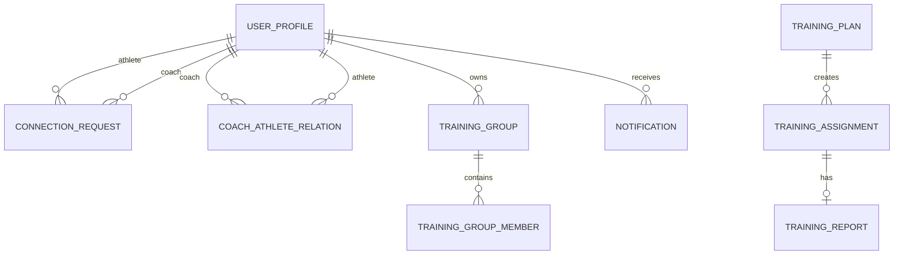
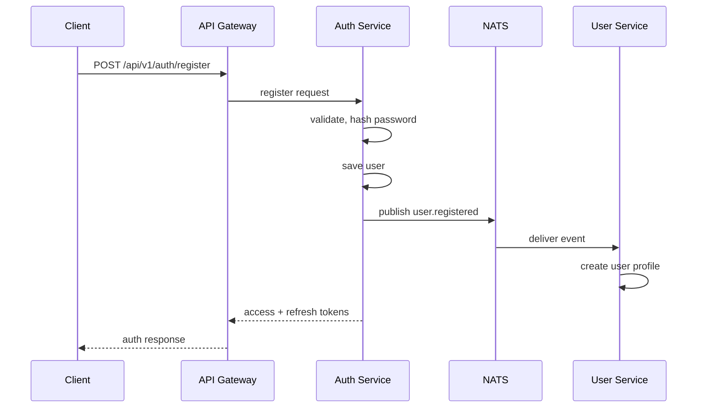
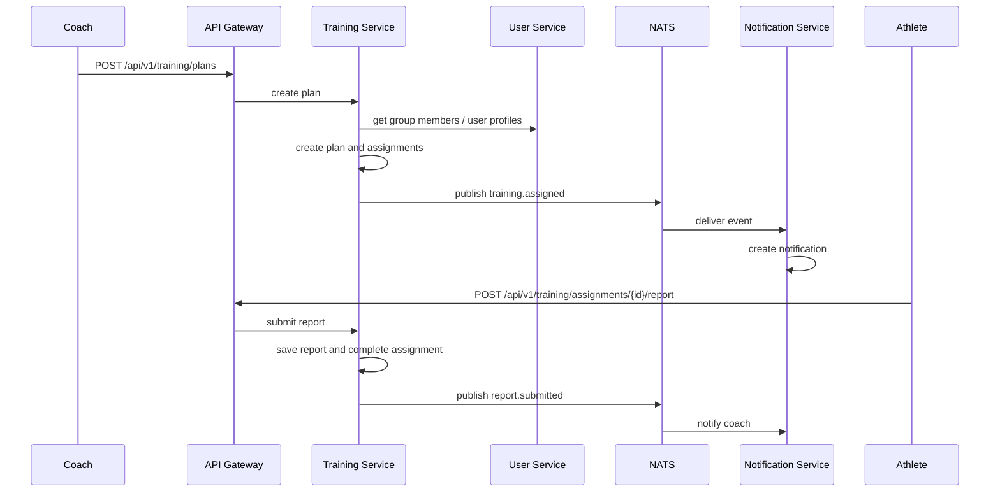
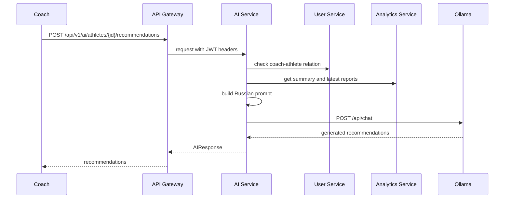

# Черновик текста диплома по backend-части CoachLink

> Черновик написан в формате Markdown, чтобы его было удобно редактировать. При переносе в LaTeX следует заменить Markdown-таблицы и диаграммы на окружения `table`, `figure` и подписи по требованиям кафедры.

## Введение

Современный тренировочный процесс требует постоянного обмена информацией между тренером и спортсменом. Тренер должен своевременно передавать индивидуальные и групповые тренировочные задания, отслеживать их выполнение, получать обратную связь и на основании накопленных данных корректировать дальнейшую подготовку. На практике этот процесс часто организован через мессенджеры, электронные таблицы и произвольные текстовые сообщения. Такой подход удобен на начальном этапе, но плохо масштабируется при увеличении количества спортсменов и тренировочных групп.

Основная проблема заключается в отсутствии единого формата взаимодействия. Один спортсмен может присылать отчёт в виде сообщения в мессенджере, другой ведёт таблицу, третий отправляет фотографию записей из тетради. В результате тренеру приходится собирать данные из разных каналов, вручную сопоставлять их с тренировочными заданиями и самостоятельно приводить отчёты к пригодному для анализа виду. Дополнительно усложняется контроль уведомлений: сообщение о выполненной тренировке оказывается в одном потоке с личной перепиской и может быть пропущено.

Актуальность работы связана с необходимостью создания единого backend-решения, которое стандартизирует обмен тренировочными заданиями и отчётами, обеспечивает хранение данных о тренировочном процессе и создаёт основу для последующего анализа. В отличие от простого обмена сообщениями, такая система должна учитывать роли пользователей, связи между тренером и спортсменами, тренировочные группы, историю назначений, отчёты о выполнении, уведомления и аналитические показатели.

Объектом исследования является процесс информационного взаимодействия между тренером и спортсменом при планировании и контроле тренировок.

Предметом исследования является backend-платформа для автоматизации назначения тренировок, сбора отчётов, уведомлений и анализа данных тренировочного процесса.

Цель работы — разработать открытую микросервисную backend-платформу CoachLink для автоматизации взаимодействия в системе «тренер-спортсмен».

Для достижения поставленной цели необходимо решить следующие задачи:

1. Проанализировать существующие способы организации взаимодействия тренера со спортсменами.
2. Сформулировать требования к backend-платформе для тренировочного процесса.
3. Спроектировать микросервисную архитектуру системы и определить ответственность сервисов.
4. Реализовать backend-сервисы авторизации, пользователей, тренировок, уведомлений, аналитики и AI-рекомендаций.
5. Описать публичные API и механизмы межсервисного взаимодействия.
6. Провести тестирование реализованных backend-компонентов.

В работе рассматривается именно backend-часть платформы. Мобильное приложение выступает внешним клиентом, который обращается к системе через REST API, и не является результатом разработки автора данной работы.

Первая предметная реализация платформы ориентирована на лёгкую атлетику. Такой выбор обусловлен тем, что автор занимается этим видом спорта и понимает специфику тренировочных отчётов: длительность, дистанцию, воспринимаемую нагрузку и показатели пульса. При этом архитектура платформы не ограничивается лёгкой атлетикой: базовые сущности тренировочного плана, назначения, отчёта, группы и уведомления могут быть расширены для других видов спорта.

Практическая значимость работы заключается в создании открытой backend-платформы, которую можно использовать как основу для дальнейшего развития: добавления новых видов спорта, интеграции со спортивными устройствами, расширения аналитики и подключения дополнительных клиентских приложений.

Работа состоит из введения, трёх глав и заключения. В первой главе проводится аналитический обзор существующих подходов. Во второй главе описывается проектирование backend-архитектуры. В третьей главе рассматриваются реализация и тестирование разработанной системы.

## Глава 1. Аналитический обзор

### 1.1 Проблема организации тренировочного взаимодействия

Работа тренера с группой спортсменов включает несколько повторяющихся процессов: подготовку тренировочного задания, передачу задания спортсмену, получение отчёта о выполнении, анализ состояния спортсмена и корректировку дальнейшего плана. Если у тренера один спортсмен, такой процесс можно организовать вручную. Однако при работе с несколькими группами и десятками спортсменов ручное ведение быстро становится неудобным.

Наиболее распространённый подход — использование мессенджеров. Тренер отправляет задания в личные сообщения или групповые чаты, а спортсмены присылают отчёты в произвольном виде. Преимущество такого подхода заключается в низком пороге входа: не требуется отдельная система, пользователи уже знакомы с интерфейсом. Недостатки становятся заметны при накоплении данных: отчёты трудно искать, сравнивать, анализировать и связывать с конкретными тренировочными заданиями.

Второй подход — использование электронных таблиц. Таблицы позволяют частично структурировать данные и хранить историю тренировок. Однако они плохо подходят для уведомлений, ролевой модели, групповых назначений и контроля доступа. Кроме того, спортсмены могут заполнять таблицы по-разному, что снова приводит к неоднородности данных.

Третий подход — спортивные трекеры и приложения. Они хорошо фиксируют фактические показатели активности, например дистанцию, темп и пульс. Но такие сервисы обычно ориентированы на сбор данных с устройств, а не на полный цикл взаимодействия тренера и спортсмена: создание задания, назначение группе, отчёт спортсмена, уведомление тренера и анализ выполнения.

Четвёртый подход — закрытые коммерческие платформы для тренеров. Они могут предоставлять богатую функциональность, но часто имеют ограничения по доступности, стоимости, открытости API и возможности доработки под конкретный тренировочный процесс. Для учебного и исследовательского проекта важным является наличие открытой архитектуры, которую можно развивать и адаптировать.

### 1.2 Сравнение подходов

| Подход | Единый формат отчётов | Групповые назначения | Уведомления | Аналитика | Открытость и расширяемость |
|---|---|---|---|---|---|
| Мессенджеры | Нет | Частично | Да, но без отделения от личных сообщений | Нет | Низкая |
| Электронные таблицы | Частично | Частично | Нет | Ограниченная | Средняя |
| Спортивные трекеры | Да, для активности | Ограниченно | Да | Да, по данным устройств | Низкая или средняя |
| Закрытые платформы | Да | Да | Да | Да | Зависит от платформы |
| CoachLink backend | Да | Да | Да | Да | Высокая |

Из сравнения следует, что для решения поставленной проблемы требуется не отдельный чат или таблица, а специализированная backend-платформа. Она должна поддерживать единый формат данных, роли пользователей, связи между тренерами и спортсменами, тренировочные группы, события и API для внешних клиентов.

### 1.3 Требования к backend-платформе

На основании анализа предметной области можно выделить следующие функциональные требования:

1. Регистрация и аутентификация пользователей с ролями `coach` и `athlete`.
2. Создание связи между спортсменом и тренером через механизм заявок.
3. Поиск пользователей по имени и логину.
4. Создание тренировочных групп и управление составом групп.
5. Создание тренировочных планов и назначение их отдельным спортсменам или группе.
6. Поддержка шаблонов тренировок для повторного использования.
7. Отправка спортсменом стандартизированного отчёта о выполнении задания.
8. Создание уведомлений о важных событиях.
9. Получение аналитических показателей по тренировочному процессу.
10. Генерация AI-рекомендаций по последним отчётам спортсмена.

К нефункциональным требованиям относятся:

1. Разделение backend на независимые сервисы.
2. Документирование API через OpenAPI.
3. Использование контейнеризации для локального развёртывания.
4. Хранение данных в PostgreSQL.
5. Асинхронное межсервисное взаимодействие через брокер сообщений.
6. Возможность расширения под другие виды спорта.

### 1.4 Выводы по главе 1

В результате аналитического обзора установлено, что существующие способы организации тренировочного взаимодействия не решают задачу комплексно. Мессенджеры удобны для общения, но не обеспечивают структуру данных. Электронные таблицы позволяют хранить информацию, но не дают полноценной ролевой модели и уведомлений. Спортивные трекеры собирают данные активности, но не покрывают весь процесс взаимодействия тренера и спортсмена.

Для решения выявленных проблем требуется backend-платформа, которая объединяет управление пользователями, тренировочными заданиями, отчётами, уведомлениями и аналитикой. В следующей главе рассматривается проектирование такой платформы.

## Глава 2. Проектная часть

### 2.1 Общая архитектура системы

CoachLink спроектирована как микросервисная backend-платформа. Микросервисный подход выбран потому, что разные части системы имеют разные зоны ответственности: авторизация, пользователи, тренировки, уведомления, аналитика и AI-рекомендации могут развиваться независимо. Такой подход упрощает расширение платформы и позволяет изолировать изменения внутри отдельных сервисов.

Мобильное приложение и возможные web-клиенты взаимодействуют с backend через API Gateway. Gateway является единой точкой входа, проверяет JWT-токены и перенаправляет запросы в нужный сервис. Внутренние сервисы получают идентификатор пользователя и его роль через HTTP-заголовки, выставленные Gateway.

Основные backend-компоненты:

| Компонент | Назначение |
|---|---|
| API Gateway | Единая точка входа, проверка JWT, маршрутизация |
| Auth Service | Регистрация, вход, refresh/logout, выпуск токенов |
| User Service | Профили, связи тренер-спортсмен, группы |
| Training Service | Планы, назначения, шаблоны, отчёты |
| Notification Service | Уведомления и FCM-токены |
| Analytics Service | Агрегация статистики и прогресса |
| AI Service | Рекомендации по последним отчётам спортсмена |
| NATS JetStream | Асинхронная доставка событий |
| PostgreSQL | Хранение данных сервисов |
| Ollama | Локальный запуск LLM-модели |

Компонентная схема backend:



### 2.2 Обоснование технологического стека

В качестве основного языка backend-разработки выбран Go. Он подходит для микросервисных систем благодаря простой модели конкурентности, высокой скорости компиляции, развитой стандартной библиотеке и большому набору библиотек для HTTP-сервисов, работы с базами данных и брокерами сообщений.

Для HTTP API используется Echo. Этот фреймворк предоставляет маршрутизацию, middleware, обработку запросов и удобную интеграцию с валидацией. Для доступа к PostgreSQL применяется `sqlx`, так как он позволяет сохранять контроль над SQL-запросами и при этом упрощает маппинг результатов в структуры Go. Миграции базы данных выполняются через `goose`.

Для аутентификации используется схема access/refresh токенов. Access token реализован как JWT и содержит идентификатор пользователя, логин и роль. Пароли хранятся в виде bcrypt-хешей. Для асинхронного взаимодействия сервисов используется NATS JetStream, обеспечивающий durable-подписки и доставку событий после временной недоступности сервиса.

Контейнеризация выполнена через Docker Compose. Это позволяет запускать сервисы, PostgreSQL, NATS, Ollama и вспомогательную инфраструктуру одной командой. API документируется через OpenAPI, что делает backend-контракты пригодными для подключения внешних клиентов.

Redis присутствует в инфраструктуре разработки, но в текущей реализации не рассматривается как реализованный механизм кеширования. Rate limiting также не заявляется как реализованная часть backend, а относится к направлению дальнейшего развития.

### 2.3 Модель данных

Каждый stateful-сервис имеет собственную область хранения. Такой подход соответствует принципу независимости сервисов: сервис не обращается напрямую к таблицам другого сервиса, а использует публичный или внутренний API.

Основные таблицы:

| Сервис | Таблицы | Назначение |
|---|---|---|
| Auth Service | `users`, `refresh_tokens` | Учётные данные, роли, refresh-токены |
| User Service | `user_profiles`, `connection_requests`, `coach_athlete_relations`, `training_groups`, `training_group_members` | Профили, связи, группы |
| Training Service | `training_plans`, `training_assignments`, `training_reports`, `training_templates` | Планы, назначения, отчёты, шаблоны |
| Notification Service | `notifications`, `device_tokens` | Уведомления и токены устройств |

ER-диаграмма ключевых сущностей:



Стандартизированный отчёт в первой версии включает текстовый комментарий, длительность тренировки, воспринимаемую нагрузку, пульс и дистанцию. Эти поля хорошо подходят для лёгкой атлетики. При расширении на другие виды спорта возможно добавление структурированных упражнений, sport-specific метрик и дополнительных шаблонов.

### 2.4 Межсервисное взаимодействие

В системе используется два типа межсервисного взаимодействия.

Синхронное HTTP-взаимодействие применяется, когда данные нужны немедленно. Например, Training Service обращается к User Service, чтобы получить состав группы и данные спортсменов при создании тренировочного плана. Analytics Service обращается к Training Service за отчётами и агрегатами. AI Service проверяет связь тренера со спортсменом через User Service и получает данные через Analytics Service.

Асинхронное взаимодействие через NATS JetStream используется для событий, которые не должны блокировать основной пользовательский сценарий. Auth Service публикует событие `coachlink.user.registered`, после чего User Service создаёт профиль. User Service и Training Service публикуют события о заявках, группах, назначениях и отчётах, а Notification Service создаёт по ним уведомления.

Основные события:

| Событие | Источник | Получатель | Назначение |
|---|---|---|---|
| `coachlink.user.registered` | Auth Service | User Service | Создание профиля |
| `coachlink.connection.requested` | User Service | Notification Service | Уведомление тренера |
| `coachlink.connection.accepted` | User Service | Notification Service | Уведомление спортсмена |
| `coachlink.training.assigned` | Training Service | Notification Service | Уведомление спортсмена |
| `coachlink.training.deleted` | Training Service | Notification Service | Уведомление спортсмена |
| `coachlink.report.submitted` | Training Service | Notification Service | Уведомление тренера |
| `coachlink.group.athlete_added` | User Service | Notification Service | Уведомление спортсмена |
| `coachlink.group.athlete_removed` | User Service | Notification Service | Уведомление спортсмена |

### 2.5 Ключевые сценарии

Регистрация пользователя:



Назначение тренировки и отправка отчёта:



AI-рекомендация:



### 2.6 Выводы по главе 2

В проектной части была предложена микросервисная backend-архитектура CoachLink. Разделение на сервисы позволяет независимо развивать авторизацию, пользователей, тренировочный процесс, уведомления, аналитику и AI-рекомендации. Использование REST API, OpenAPI и событий NATS JetStream обеспечивает интеграцию между компонентами и возможность подключения внешних клиентов.

## Глава 3. Реализация и тестирование

### 3.1 API Gateway

API Gateway является единой точкой входа в backend. Он принимает внешние HTTP-запросы, проверяет JWT access token и перенаправляет запрос в соответствующий сервис. Для всех защищённых маршрутов Gateway извлекает из токена идентификатор пользователя, роль и логин, после чего передаёт их во внутренние сервисы через заголовки `X-User-ID`, `X-User-Role` и `X-User-Login`.

Публичными без авторизации являются только маршруты регистрации, входа и обновления токена. Остальные запросы требуют заголовок `Authorization: Bearer <token>`.

### 3.2 Auth Service

Auth Service отвечает за регистрацию, вход, обновление и отзыв refresh-токенов. При регистрации сервис валидирует входные данные, проверяет формат логина, хеширует пароль с помощью bcrypt и сохраняет пользователя в таблицу `users`. После успешной регистрации публикуется событие `coachlink.user.registered`, которое используется User Service для создания пользовательского профиля.

При входе сервис проверяет логин и пароль, после чего выпускает пару токенов: короткоживущий JWT access token и refresh token. Refresh token хранится в базе не в открытом виде, а как SHA-256 хеш. При обновлении токена старый refresh token удаляется, что уменьшает риск повторного использования.

### 3.3 User Service

User Service хранит профили пользователей, связи между тренерами и спортсменами и тренировочные группы. Профиль создаётся на основании события регистрации из Auth Service. Такой подход отделяет учётные данные от доменной информации о пользователе.

Связь между спортсменом и тренером создаётся через заявку. Спортсмен отправляет заявку тренеру, тренер может принять или отклонить её. При принятии заявки создаётся связь в таблице `coach_athlete_relations`. В первой версии у спортсмена может быть один тренер, что упрощает модель доступа и предотвращает неоднозначность владения тренировочными назначениями.

Тренер может создавать тренировочные группы и добавлять в них только связанных с ним спортсменов. Сервис также предоставляет внутренние API для других сервисов: получение состава группы, получение профиля пользователя и проверку принадлежности спортсмена тренеру.

### 3.4 Training Service

Training Service реализует основную логику тренировочного процесса. Тренер создаёт тренировочный план, указывает дату, описание и список спортсменов или группу. Если указан идентификатор группы, сервис получает состав группы из User Service и создаёт назначения для всех участников. Для ускорения фильтрации в назначении денормализуются имя и логин спортсмена.

Назначение может иметь статусы `assigned`, `completed` и `archived`. После отправки отчёта спортсменом статус меняется на `completed`. Тренер может архивировать выполненное назначение. Просроченность вычисляется при чтении: задание считается просроченным, если оно находится в статусе `assigned` и дата выполнения уже прошла.

Отчёт спортсмена содержит стандартизированные поля: текстовый комментарий, длительность, воспринимаемую нагрузку, максимальный и средний пульс, дистанцию. Эти данные формируют основу для аналитики и AI-рекомендаций.

### 3.5 Notification Service

Notification Service подписан на события NATS JetStream и создаёт уведомления для пользователей. Например, при событии `training.assigned` создаётся уведомление для спортсмена, а при событии `report.submitted` — уведомление для тренера.

Сервис хранит уведомления в PostgreSQL, поддерживает получение списка уведомлений, фильтрацию по признаку прочтения, счётчик непрочитанных уведомлений, пометку одного уведомления или всех уведомлений как прочитанных. Также реализована регистрация FCM-токенов устройства. Отправка push-уведомлений рассматривается как best-effort механизм: если FCM не настроен, хранение уведомлений в базе продолжает работать.

### 3.6 Analytics Service

Analytics Service не имеет собственной базы данных. Он обращается к внутренним API Training Service и агрегирует данные на лету. Такой подход уменьшает риск рассинхронизации данных и упрощает первую версию реализации.

Сервис предоставляет сводную статистику спортсмена, прогресс по неделям или месяцам и обзор для тренера. Среди метрик используются количество отчётов, суммарная длительность, средняя нагрузка, средний пульс, суммарная дистанция и процент выполнения заданий.

### 3.7 AI Service

AI Service предоставляет одну публичную ручку: `POST /api/v1/ai/athletes/{id}/recommendations`. Она доступна только тренеру. Перед генерацией сервис проверяет, что указанный спортсмен связан с текущим тренером.

Для формирования рекомендаций AI Service получает из Analytics Service сводную статистику и последние отчёты спортсмена. Количество отчётов ограничивается пятью, чтобы prompt оставался компактным. Типовой сценарий — рекомендации по последним 3-5 тренировкам. Prompt составляется на русском языке и содержит числовые показатели, комментарии спортсмена и дополнительный контекст от тренера, если он передан в запросе.

Генерация выполняется через локальный сервер Ollama с моделью `gemma3:4b`. AI-модуль рассматривается как вспомогательный инструмент тренера: он помогает выделить тенденции и возможные корректировки нагрузки, но не заменяет профессиональное тренерское решение.

Пример запроса:

```json
{
  "context": "Подготовка к соревнованиям на 800м через 2 месяца"
}
```

Пример ответа:

```json
{
  "athlete_id": "uuid",
  "type": "recommendations",
  "content": "Текст рекомендаций от LLM...",
  "generated_at": "2026-04-13T12:00:00Z",
  "model": "gemma3:4b"
}
```

### 3.8 Публичные API-группы

| Группа API | Назначение |
|---|---|
| `/api/v1/auth/*` | Регистрация, вход, refresh/logout |
| `/api/v1/users/*` | Профиль и поиск пользователей |
| `/api/v1/connections/*` | Заявки и связи тренер-спортсмен |
| `/api/v1/groups/*` | Тренировочные группы |
| `/api/v1/training/*` | Планы, назначения, отчёты, шаблоны |
| `/api/v1/notifications/*` | Уведомления и FCM-токены |
| `/api/v1/analytics/*` | Сводки, прогресс, обзор тренера |
| `/api/v1/ai/*` | AI-рекомендации |

### 3.9 Тестирование

Тестирование backend выполняется на нескольких уровнях.

Unit-тесты проверяют бизнес-логику сервисного слоя без запуска всей инфраструктуры. Они покрывают вычисление просроченности заданий, проверки прав доступа, отправку отчётов, архивацию, агрегацию аналитики, создание уведомлений и формирование prompt для AI-рекомендаций.

E2E smoke-тест проверяет основной happy path через API: регистрацию, создание связи, назначение тренировки и отправку отчёта. Интеграционные тесты предназначены для проверки всех основных endpoint-групп через API Gateway при поднятой платформе.

Фактически подтверждённые результаты на момент подготовки черновика:

| Проверка | Результат | Комментарий |
|---|---|---|
| `make test-unit` | Успешно | Прошли unit-тесты `ai-service`, `analytics-service`, `training-service`, `notification-service` |
| `go test -c` для `tests/integration` | Успешно | Интеграционный пакет компилируется |
| `make test-e2e` | Не зафиксировано | Требует поднятой платформы |
| `make test-integration` | Не зафиксировано | Требует поднятой платформы |

В финальной версии диплома необходимо указывать только те результаты тестирования, которые были реально выполнены и зафиксированы. Если полный интеграционный прогон не запускался, его нельзя описывать как успешно пройденный.

### 3.10 Выводы по главе 3

В ходе реализации были созданы backend-сервисы, покрывающие основные сценарии взаимодействия тренера и спортсмена: регистрацию, создание связи, управление группами, назначение тренировок, отправку отчётов, уведомления, аналитику и AI-рекомендации. Реализованная архитектура позволяет хранить структурированные данные тренировочного процесса и расширять платформу в дальнейших версиях.

## Заключение

В результате работы была разработана открытая микросервисная backend-платформа CoachLink для автоматизации тренировочного процесса и взаимодействия в системе «тренер-спортсмен». Платформа предоставляет единый API для регистрации пользователей, управления связями, создания тренировочных групп, назначения тренировочных планов, сбора отчётов, уведомлений и анализа тренировочных данных.

Поставленная цель достигнута: реализован backend, который заменяет разрозненный обмен сообщениями и отчётами единым структурированным механизмом. Тренер получает возможность централизованно назначать задания и отслеживать выполнение, а спортсмен — отправлять отчёты в едином формате.

В ходе работы были решены основные задачи:

1. Проведён анализ существующих способов организации тренировочного взаимодействия.
2. Сформулированы требования к backend-платформе.
3. Спроектирована микросервисная архитектура CoachLink.
4. Реализованы сервисы авторизации, пользователей, тренировок, уведомлений, аналитики и AI-рекомендаций.
5. Описаны API и механизмы межсервисного взаимодействия.
6. Проведена проверка части backend-компонентов с помощью unit-тестов и компиляции интеграционного тестового пакета.

Практическая значимость работы состоит в том, что платформа может использоваться как основа для дальнейшего развития открытого инструмента для тренеров и спортсменов. Накопление структурированных данных создаёт базу для аналитики тренировочного процесса, а микросервисная архитектура позволяет независимо развивать отдельные компоненты.

Текущая версия предметно ориентирована на лёгкую атлетику, однако это не является архитектурным ограничением. В дальнейшем возможно расширение модели тренировок за счёт структурированных упражнений, поддержки других видов спорта, интеграции со спортивными устройствами, расширения AI-сценариев, добавления production-наблюдаемости и rate limiting.

## Приложения, Которые Стоит Подготовить

### Приложение А. OpenAPI-спецификация

В приложении можно привести ссылку на `docs/api/openapi.yaml` или фрагменты ключевых endpoint-групп.

### Приложение Б. Docker Compose

В приложении можно привести фрагмент `deployments/docker-compose.yml`, показывающий состав backend-инфраструктуры.

### Приложение В. Примеры API-ответов

Рекомендуемые примеры:

- регистрация пользователя;
- создание тренировочного плана;
- отправка отчёта;
- получение аналитической сводки;
- получение AI-рекомендации.
