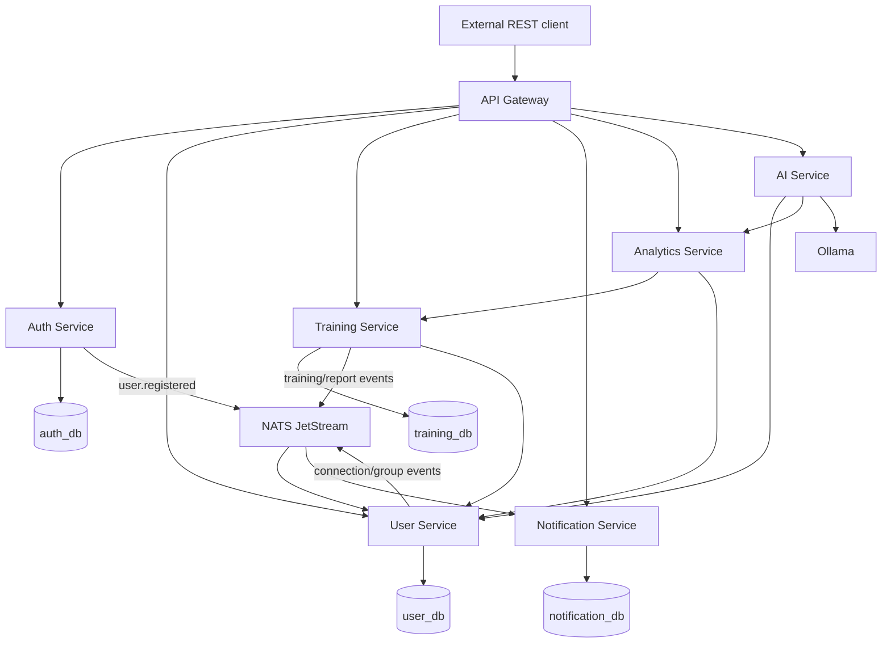
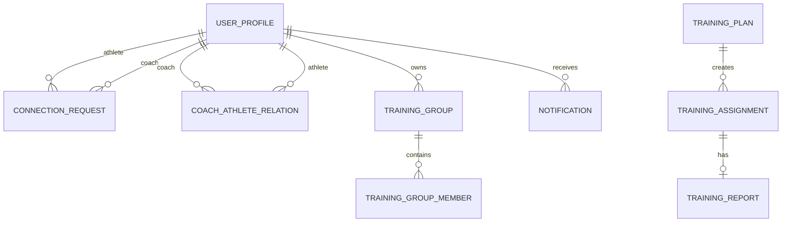
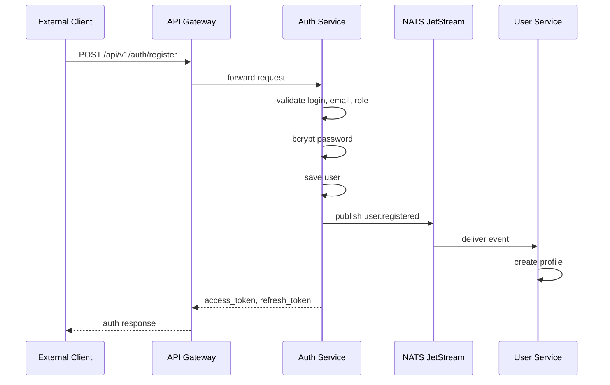
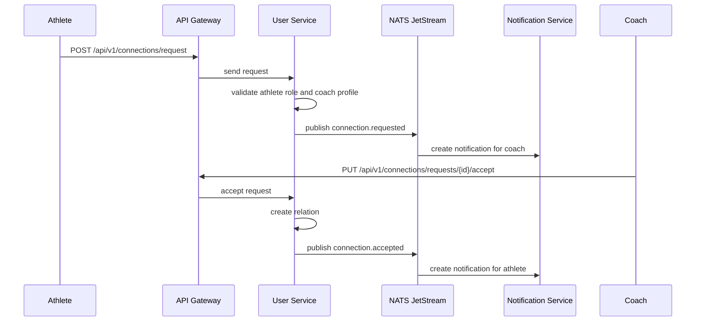
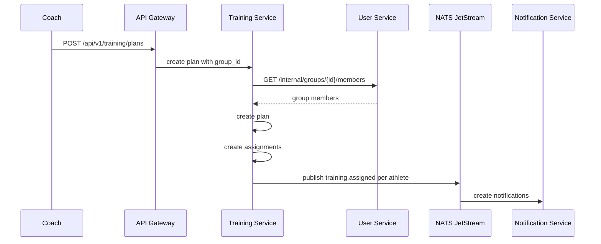
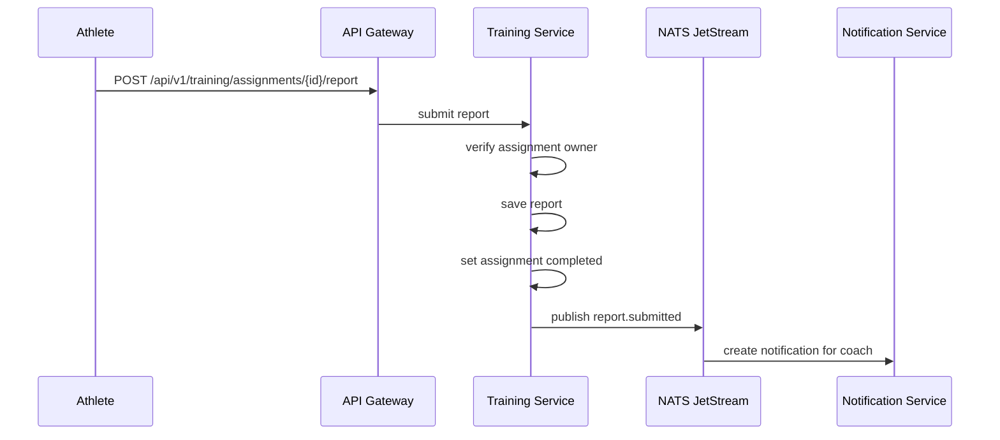
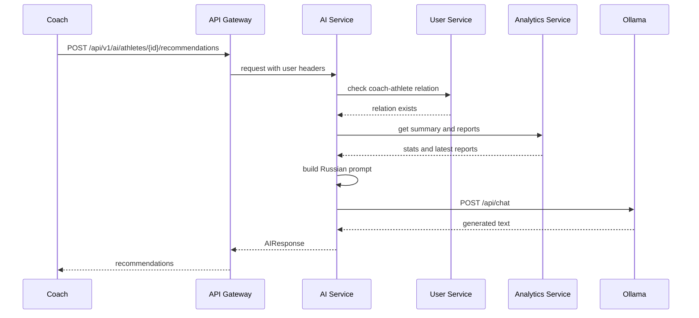

# Глава 2. Проектная часть

## 2.1 Общий подход к проектированию

Целью проектной части является построение backend-архитектуры, которая покрывает основные сценарии взаимодействия тренера и спортсмена и при этом остаётся расширяемой. Система должна быть пригодна для развития: добавления новых видов спорта, подключения внешних клиентов, появления дополнительных аналитических модулей и интеграций со спортивными устройствами.

Для решения этой задачи выбран микросервисный подход. Он позволяет разделить систему на независимые компоненты по предметным областям. В CoachLink такими областями являются авторизация, профили и связи пользователей, тренировочный процесс, уведомления, аналитика и AI-рекомендации.

Монолитная архитектура для первой версии могла бы быть проще в реализации, однако она хуже демонстрирует независимость предметных модулей и сложнее масштабируется организационно. В системе «тренер-спортсмен» отдельные части имеют разную природу. Например, сервис авторизации отвечает за безопасность и токены, сервис тренировок — за предметную логику назначений и отчётов, сервис уведомлений — за реакцию на события, а сервис аналитики — за расчёт показателей. Разделение этих частей повышает ясность архитектуры.

Проектирование выполнялось с учётом следующих принципов:

1. Единая точка входа для внешних клиентов.
2. Разделение ответственности между сервисами.
3. Собственная база данных для stateful-сервисов.
4. Использование событий для асинхронных операций.
5. Использование внутренних API для синхронных межсервисных запросов.
6. Документирование публичного API.
7. Возможность расширения предметной модели.

## 2.2 Высокоуровневая архитектура

Внешний клиент взаимодействует с платформой через API Gateway. Клиентом может быть мобильное приложение, web-интерфейс или другой сервис. В рамках данной работы клиентская часть не рассматривается как результат разработки, а используется только как потребитель REST API.

API Gateway проверяет авторизацию и перенаправляет запросы к backend-сервисам. Сервисы реализованы на Go и взаимодействуют между собой через HTTP и NATS JetStream. Для хранения данных используется PostgreSQL. Для генерации AI-рекомендаций используется локальный LLM-сервер Ollama.

Компонентная схема:



В такой архитектуре API Gateway не содержит предметной бизнес-логики. Его задача — принять запрос, проверить JWT, добавить служебные заголовки и передать запрос в нужный сервис. Предметные правила остаются внутри соответствующих сервисов.

## 2.3 Состав сервисов

### 2.3.1 API Gateway

API Gateway является входной точкой для всех публичных HTTP-запросов. Он решает следующие задачи:

- маршрутизация запросов по префиксам;
- проверка JWT access token;
- извлечение идентификатора пользователя, роли и логина из токена;
- проброс пользовательского контекста во внутренние сервисы через заголовки;
- обработка CORS;
- предоставление health-check endpoint.

Публичные маршруты без авторизации ограничены регистрацией, входом и обновлением токена:

- `POST /api/v1/auth/register`;
- `POST /api/v1/auth/login`;
- `POST /api/v1/auth/refresh`.

Остальные маршруты требуют заголовок `Authorization: Bearer <token>`. После успешной проверки Gateway устанавливает заголовки:

- `X-User-ID`;
- `X-User-Role`;
- `X-User-Login`.

Такой подход позволяет не проверять JWT повторно в каждом сервисе. Внутренние сервисы доверяют Gateway как единой точке входа и используют переданные заголовки для проверки прав доступа.

### 2.3.2 Auth Service

Auth Service отвечает за учётные данные и токены. В его область ответственности входят:

- регистрация пользователя;
- валидация логина, email, пароля и роли;
- хеширование пароля;
- вход пользователя;
- выпуск access token и refresh token;
- обновление пары токенов;
- отзыв refresh token при logout;
- публикация события регистрации.

Access token реализован как JWT. В payload токена включаются:

```json
{
  "sub": "uuid пользователя",
  "login": "user_login",
  "role": "coach | athlete",
  "exp": 1234567890,
  "iat": 1234567890
}
```

Refresh token хранится в базе данных не в открытом виде, а в виде SHA-256 хеша. Это снижает риск компрометации токена при утечке базы данных. При refresh старый токен удаляется, а пользователю выдаётся новая пара токенов.

После успешной регистрации Auth Service публикует событие `coachlink.user.registered`. Это событие используется User Service для создания пользовательского профиля.

### 2.3.3 User Service

User Service отвечает за доменную информацию о пользователях. Он не хранит пароли и не выпускает токены. Его задачи:

- хранение профилей пользователей;
- синхронизация профилей из события регистрации;
- поиск пользователей по ФИО и логину;
- управление заявками спортсмена тренеру;
- управление связями тренер-спортсмен;
- управление тренировочными группами;
- предоставление внутренних API для других сервисов.

Связь тренера и спортсмена создаётся через заявку. Это решение выбрано для явного контроля доступа: спортсмен не может автоматически прикрепиться к тренеру без подтверждения. Тренер видит входящие заявки и может принять или отклонить их.

Тренировочные группы принадлежат тренеру. Добавлять в группу можно только спортсменов, которые уже связаны с этим тренером. Это предотвращает ситуацию, когда тренер назначает тренировку спортсмену, не входящему в его область ответственности.

### 2.3.4 Training Service

Training Service реализует центральную предметную логику платформы. Он отвечает за:

- создание тренировочных планов;
- назначение планов спортсменам;
- назначение планов группе;
- получение списка назначений;
- фильтрацию назначений;
- удаление и архивирование назначений;
- отправку отчётов;
- хранение шаблонов тренировок;
- предоставление внутренних API для аналитики.

Тренировочный план содержит название, описание и дату. Назначение связывает план с конкретным спортсменом. Такое разделение позволяет одному плану соответствовать нескольким назначениям, если тренировка выдана группе.

Назначение имеет статус:

- `assigned` — задание назначено и ожидает отчёта;
- `completed` — спортсмен отправил отчёт;
- `archived` — тренер перенёс выполненное задание в архив.

Просроченность не хранится как отдельное поле, а вычисляется при чтении. Это уменьшает риск рассинхронизации данных. Назначение считается просроченным, если оно находится в статусе `assigned`, а дата выполнения уже прошла.

### 2.3.5 Notification Service

Notification Service создаёт и хранит уведомления. Он подписывается на события NATS JetStream и реагирует на них созданием записи в таблице `notifications`.

Сервис обрабатывает события:

- заявка спортсмена тренеру;
- принятие или отклонение заявки;
- назначение тренировки;
- удаление задания;
- отправка отчёта;
- добавление спортсмена в группу;
- удаление спортсмена из группы.

Пользователь может получить список уведомлений, отфильтровать их по признаку прочтения, получить количество непрочитанных уведомлений в ответе списка и отметить уведомления как прочитанные. Также сервис хранит FCM-токены устройств. Если Firebase credentials не настроены, push-доставка отключается, но уведомления продолжают сохраняться в базе данных.

### 2.3.6 Analytics Service

Analytics Service является stateless-сервисом. Он не имеет собственной базы данных, а получает данные из Training Service через внутренние API. Такое решение упрощает первую версию системы и исключает проблему синхронизации аналитической базы с основной базой тренировок.

Сервис рассчитывает:

- сводку по спортсмену;
- прогресс по неделям или месяцам;
- обзор по спортсменам тренера.

Ключевые метрики:

- количество отчётов;
- суммарная длительность;
- средняя длительность;
- суммарная дистанция;
- средняя воспринимаемая нагрузка;
- средний пульс;
- максимальный пульс;
- количество назначений;
- процент выполнения.

### 2.3.7 AI Service

AI Service предоставляет одну публичную функцию: генерацию рекомендаций по тренировочному процессу конкретного спортсмена.

Публичный endpoint:

```text
POST /api/v1/ai/athletes/{id}/recommendations
```

Сервис доступен только тренеру. Перед генерацией он проверяет через User Service, что спортсмен действительно связан с текущим тренером. Затем AI Service получает из Analytics Service сводную статистику и последние отчёты спортсмена. Количество отчётов ограничено пятью, чтобы prompt оставался компактным. Типовой сценарий — рекомендации по последним 3-5 тренировкам.

Генерация выполняется через Ollama. Prompt составляется на русском языке и содержит конкретные данные: объём тренировок, длительность, дистанцию, субъективную нагрузку, пульс и комментарии спортсмена. AI-модуль является вспомогательным инструментом и не заменяет решение тренера.

## 2.4 Модель данных

### 2.4.1 Auth Service

Auth Service использует две основные таблицы:

| Таблица | Назначение |
|---|---|
| `users` | Учётные данные пользователя, роль и пароль в виде bcrypt-хеша |
| `refresh_tokens` | Хеши refresh-токенов и срок их действия |

Таблица `users` содержит логин, email, ФИО, роль, хеш пароля и временные метки. Роль ограничена значениями `coach` и `athlete`. Таблица `refresh_tokens` связана с пользователем и позволяет отзывать refresh-токены.

### 2.4.2 User Service

User Service использует следующие таблицы:

| Таблица | Назначение |
|---|---|
| `user_profiles` | Профили пользователей, синхронизированные из Auth Service |
| `connection_requests` | Заявки спортсмена тренеру |
| `coach_athlete_relations` | Активные связи тренер-спортсмен |
| `training_groups` | Тренировочные группы тренера |
| `training_group_members` | Состав тренировочных групп |

Разделение `users` и `user_profiles` отражает разделение ответственности сервисов. Auth Service хранит учётные данные, User Service — доменную информацию для поиска, связей и групп.

### 2.4.3 Training Service

Training Service использует таблицы:

| Таблица | Назначение |
|---|---|
| `training_plans` | Общая информация о тренировочном плане |
| `training_assignments` | Назначение плана конкретному спортсмену |
| `training_reports` | Отчёт спортсмена по назначению |
| `training_templates` | Шаблоны тренировок тренера |

Отдельное хранение плана и назначения необходимо для групповых тренировок. Один план может быть создан тренером один раз, а затем назначен нескольким спортсменам. Отчёт связан с назначением, а не только с планом, потому что каждый спортсмен выполняет тренировку индивидуально и отправляет собственную обратную связь.

### 2.4.4 Notification Service

Notification Service хранит:

| Таблица | Назначение |
|---|---|
| `notifications` | Уведомления пользователей |
| `device_tokens` | FCM-токены устройств |

В уведомлении хранится тип, заголовок, текст, дополнительные данные в JSONB, признак прочтения и дата создания. JSONB-поле позволяет добавлять к уведомлению контекст: идентификатор заявки, задания или группы.

### 2.4.5 ER-диаграмма



## 2.5 Межсервисное взаимодействие

### 2.5.1 Синхронное взаимодействие

Синхронные HTTP-вызовы используются в случаях, когда результат нужен для выполнения текущего запроса.

Примеры:

1. Training Service обращается к User Service при назначении плана группе, чтобы получить список участников группы.
2. Training Service получает профиль спортсмена, чтобы сохранить имя и логин в назначении.
3. Analytics Service обращается к Training Service за отчётами и агрегатами.
4. AI Service обращается к User Service для проверки связи тренера и спортсмена.
5. AI Service обращается к Analytics Service за сводкой и последними отчётами.

Внутренние API не предназначены для внешних клиентов. Они используются только сервисами внутри backend-платформы.

### 2.5.2 Асинхронное взаимодействие

Асинхронное взаимодействие реализовано через NATS JetStream. Оно используется там, где действие может быть выполнено после основного запроса и не должно блокировать пользователя.

Например, при создании тренировочного назначения Training Service публикует событие `coachlink.training.assigned`. Notification Service получает событие и создаёт уведомление для спортсмена. Если Notification Service временно недоступен, JetStream durable consumer позволяет обработать событие после восстановления сервиса.

Список ключевых событий:

| Событие | Источник | Получатель | Назначение |
|---|---|---|---|
| `coachlink.user.registered` | Auth Service | User Service | Создание профиля |
| `coachlink.connection.requested` | User Service | Notification Service | Уведомление тренера |
| `coachlink.connection.accepted` | User Service | Notification Service | Уведомление спортсмена |
| `coachlink.connection.rejected` | User Service | Notification Service | Уведомление спортсмена |
| `coachlink.group.athlete_added` | User Service | Notification Service | Уведомление спортсмена |
| `coachlink.group.athlete_removed` | User Service | Notification Service | Уведомление спортсмена |
| `coachlink.training.assigned` | Training Service | Notification Service | Уведомление спортсмена |
| `coachlink.training.deleted` | Training Service | Notification Service | Уведомление спортсмена |
| `coachlink.report.submitted` | Training Service | Notification Service | Уведомление тренера |

## 2.6 Проектирование ключевых сценариев

### 2.6.1 Регистрация пользователя



### 2.6.2 Создание связи тренер-спортсмен



### 2.6.3 Назначение тренировки группе



### 2.6.4 Отправка отчёта



### 2.6.5 Получение AI-рекомендации



## 2.7 Проектирование публичного API

Публичный API разделён на группы по предметным областям:

| Группа | Назначение |
|---|---|
| `/api/v1/auth/*` | Регистрация, вход, обновление и отзыв токенов |
| `/api/v1/users/*` | Профиль текущего пользователя и поиск |
| `/api/v1/connections/*` | Заявки и связи тренер-спортсмен |
| `/api/v1/groups/*` | Тренировочные группы |
| `/api/v1/training/*` | Планы, назначения, отчёты, шаблоны |
| `/api/v1/notifications/*` | Уведомления |
| `/api/v1/analytics/*` | Аналитика тренировок |
| `/api/v1/ai/*` | AI-рекомендации |

Такое разделение упрощает маршрутизацию на уровне API Gateway и делает API понятным для внешних клиентов.

## 2.8 Расширяемость под другие виды спорта

Хотя первая версия ориентирована на лёгкую атлетику, архитектура не ограничивается этим видом спорта. Универсальными являются:

- пользователи и роли;
- связи тренер-спортсмен;
- тренировочные группы;
- планы и назначения;
- отчёты;
- уведомления;
- аналитические агрегаты;
- API Gateway и межсервисное взаимодействие.

Для поддержки других видов спорта потребуется расширить предметную часть Training Service. Например, можно добавить таблицы упражнений, структурированный состав тренировочного плана, тип спорта, параметры подходов, повторений, веса, темпа, времени отдыха или других показателей. Такая доработка не требует изменения общей архитектуры: она расширяет модель тренировок, но не отменяет существующие сервисы и сценарии.

## 2.9 Выводы по главе 2

В проектной части была предложена микросервисная backend-архитектура CoachLink. Архитектура включает API Gateway, сервис авторизации, сервис пользователей, сервис тренировок, сервис уведомлений, сервис аналитики и AI-сервис рекомендаций. Для хранения данных используется PostgreSQL, для событийного взаимодействия — NATS JetStream, для локального развёртывания — Docker Compose.

Спроектированная архитектура соответствует требованиям, сформулированным в аналитической главе. Она поддерживает ролевую модель, связи тренера и спортсмена, групповые назначения, стандартизированные отчёты, уведомления и аналитику. При этом система остаётся расширяемой: текущая реализация ориентирована на лёгкую атлетику, но базовая модель может быть адаптирована для других видов спорта.
