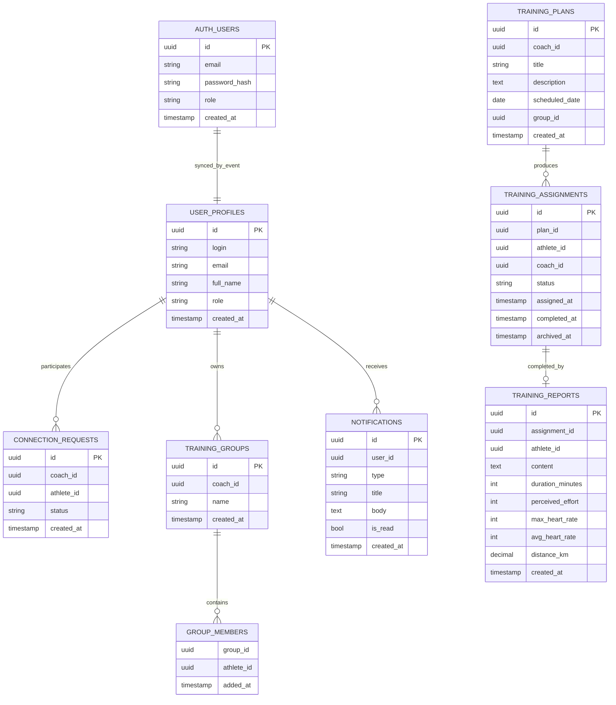
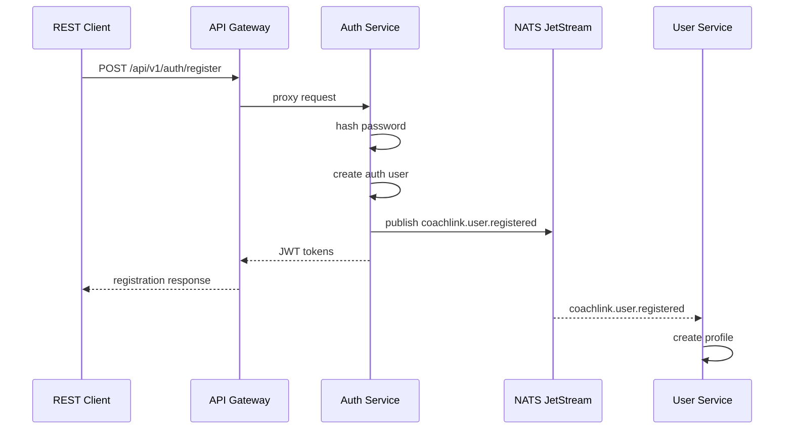
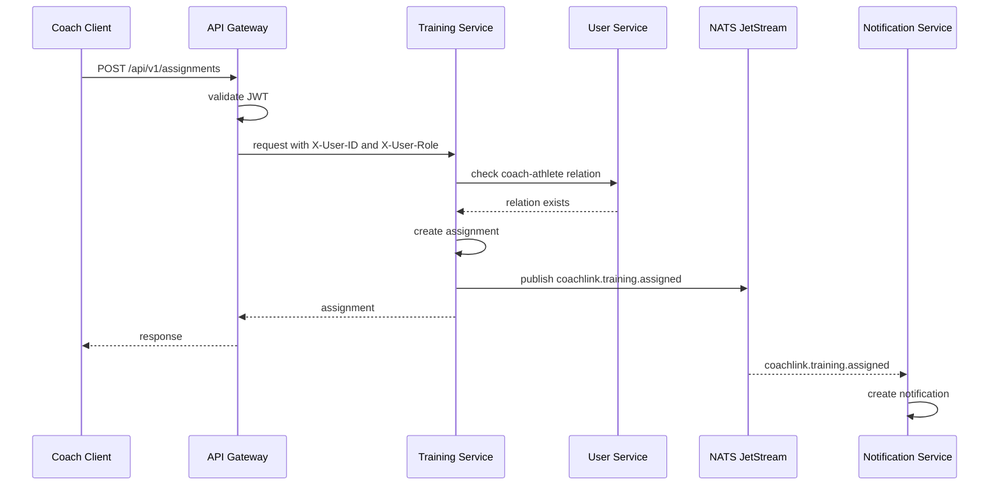
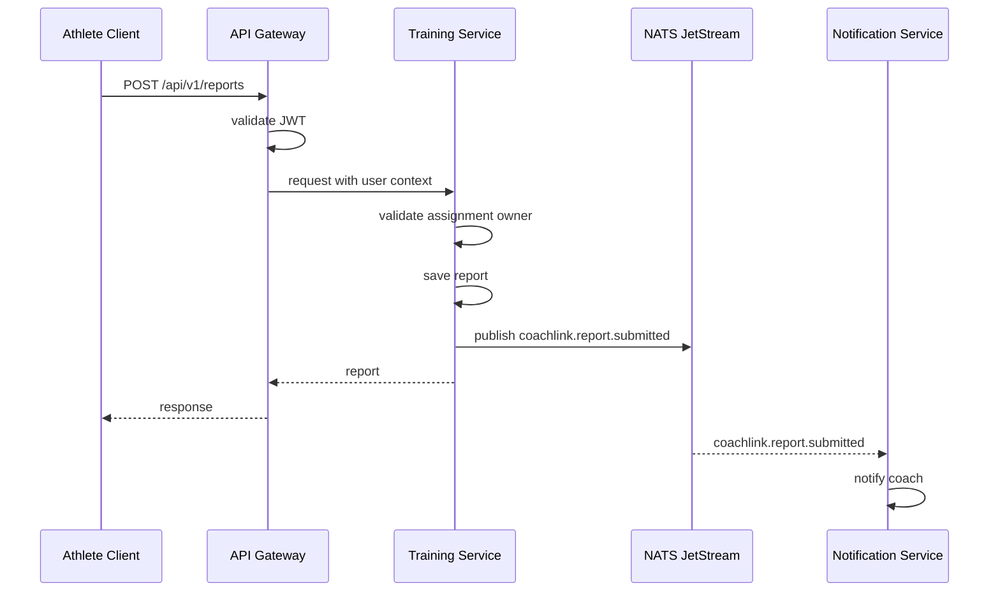
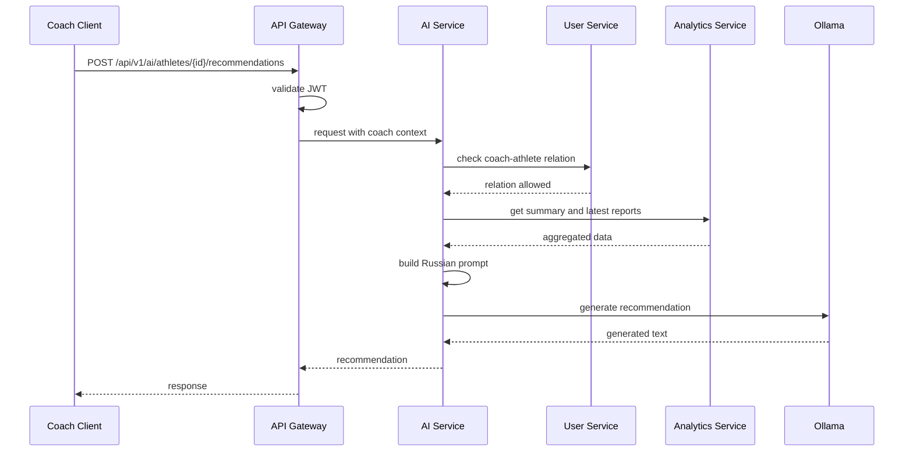

# Приложения И Артефакты Для Диплома

Этот файл содержит материалы, которые удобно использовать при финальной сборке диплома: перечень иллюстраций, таблиц, диаграмм, API-примеров и тестовых артефактов. Основной текст диплома не должен превращаться в документацию API целиком, поэтому часть технических деталей лучше вынести в приложения.

## Приложение А. Состав Backend-Сервисов

В приложение можно вынести таблицу с кратким описанием сервисов. Она помогает комиссии быстро увидеть, из каких частей состоит backend и за что отвечает каждая часть.

| Сервис | Назначение | Хранилище | Основные взаимодействия |
| --- | --- | --- | --- |
| API Gateway | Единая точка входа, JWT-проверка, reverse proxy | Не использует собственную БД | Принимает внешние REST-запросы и маршрутизирует их во внутренние сервисы |
| Auth Service | Регистрация, login, refresh/logout, выдача JWT | PostgreSQL | Публикует `coachlink.user.registered` в NATS |
| User Service | Профили, заявки, связи, группы, поиск | PostgreSQL | Принимает событие регистрации, предоставляет внутренние проверки доступа |
| Training Service | Планы, шаблоны, назначения, отчеты, статусы | PostgreSQL | Публикует события назначений и отчетов, предоставляет данные аналитике |
| Notification Service | Уведомления, unread count, FCM-токены | PostgreSQL | Подписывается на события NATS |
| Analytics Service | Summary, progress, coach overview | Stateless | Получает данные из Training Service и User Service |
| AI Service | Рекомендации по последним отчетам спортсмена | Stateless | Проверяет связь через User Service, получает данные из Analytics Service, обращается к Ollama |

В тексте важно подчеркнуть, что AI Service и Analytics Service являются stateless-сервисами в рамках текущей версии. Они не владеют собственными предметными данными, а вычисляют результат на основе данных других сервисов.

## Приложение Б. Группы Публичного API

В приложение можно добавить таблицу публичных API-групп. Полный OpenAPI-список уже находится в `docs/api/openapi.yaml`, а в дипломе достаточно показать сгруппированное представление.

| Группа API | Примеры endpoints | Назначение |
| --- | --- | --- |
| Auth API | `POST /api/v1/auth/register`, `POST /api/v1/auth/login`, `POST /api/v1/auth/refresh`, `POST /api/v1/auth/logout` | Регистрация и аутентификация пользователей |
| User API | `/api/v1/users/me`, `/api/v1/users/search`, `/api/v1/connections`, `/api/v1/groups` | Профили, поиск, заявки, связи, группы |
| Training API | `/api/v1/training/plans`, `/api/v1/training/assignments`, `/api/v1/training/assignments/{id}/report`, `/api/v1/training/templates` | Создание планов, назначений, отчетов и шаблонов |
| Notification API | `/api/v1/notifications`, `/api/v1/notifications/{id}/read`, `/api/v1/notifications/read-all`, `/api/v1/notifications/device-token` | Уведомления, `unread_count` в ответе списка и FCM-токены |
| Analytics API | `/api/v1/analytics/athletes/{id}/summary`, `/api/v1/analytics/athletes/{id}/progress`, `/api/v1/analytics/coach/overview` | Агрегация тренировочных данных |
| AI API | `POST /api/v1/ai/athletes/{id}/recommendations` | Генерация рекомендаций по последним отчетам спортсмена |
| System API | `/health`, `/api/v1/health` | Проверка доступности сервисов |

В дипломе не следует включать несуществующие AI endpoints. Для AI Service указывается только ручка рекомендаций.

## Приложение В. Примеры JSON-Запросов И Ответов

Примеры API лучше выбирать так, чтобы они показывали именно backend-логику, а не интерфейс мобильного приложения. Хорошо подходят примеры отправки отчета и получения AI-рекомендации.

### Пример Отправки Отчета О Тренировке

```json
{
  "content": "Выполнил кросс спокойно, последние 2 км немного быстрее.",
  "duration_minutes": 46,
  "perceived_effort": 6,
  "max_heart_rate": 174,
  "avg_heart_rate": 151,
  "distance_km": 8.0
}
```

Пример показывает тело запроса для endpoint `POST /api/v1/training/assignments/{assignmentId}/report`. Идентификатор назначения передается в path-параметре, а отчет хранится в структурированном виде. В отличие от сообщения в мессенджере, backend может использовать поля отчета для аналитики: считать недельный объем, длительность, дистанцию, среднюю воспринимаемую нагрузку и пульсовые показатели.

### Пример Ответа На Создание Отчета

```json
{
  "id": "7f9ef6c3-0fd9-4cfd-a69d-d3d1b65a157d",
  "assignment_id": "2b54c487-0ef3-4e60-8e9a-7f2fdb66c101",
  "athlete_id": "a52d4f18-e218-4d2a-bd4f-01bcb89d01f2",
  "athlete_full_name": "Петров Иван Сергеевич",
  "athlete_login": "ivan-petrov",
  "content": "Выполнил кросс спокойно, последние 2 км немного быстрее.",
  "duration_minutes": 46,
  "perceived_effort": 6,
  "max_heart_rate": 174,
  "avg_heart_rate": 151,
  "distance_km": 8.0,
  "created_at": "2026-04-18T18:30:00Z"
}
```

После создания отчета Training Service может опубликовать событие, на которое подпишется Notification Service. Благодаря этому тренер получает уведомление без прямой зависимости между Training Service и способом доставки уведомлений.

### Пример Запроса AI-Рекомендации

```json
{
  "context": "Подготовка к старту на 800 м через два месяца."
}
```

Тело запроса является необязательным. Поле `context` позволяет тренеру передать дополнительный контекст, например информацию о предстоящем старте. Количество отчетов не передается в запросе: сервис сам использует последние отчеты спортсмена и внутри реализации ограничивает выборку пятью записями. В тексте диплома можно указать, что типичный сценарий — рекомендации по 3-5 последним тренировкам.

### Пример Ответа AI Service

```json
{
  "athlete_id": "a52d4f18-e218-4d2a-bd4f-01bcb89d01f2",
  "type": "recommendations",
  "content": "**Тенденции** — спортсмен стабильно выполняет объем, но воспринимаемая нагрузка растет. **Рекомендации** — оставить один восстановительный день или снизить интенсивность следующей тренировки.",
  "generated_at": "2026-04-18T18:35:00Z",
  "model": "gemma3:4b"
}
```

В пояснении к примеру важно отметить, что AI-рекомендация является вспомогательной информацией. Она не заменяет решение тренера и не должна использоваться как автоматическое назначение тренировочного плана.

## Приложение Г. ER-Диаграмма Основных Таблиц

В финальный документ можно вставить ER-диаграмму из проектной главы или вынести ее в приложение в расширенном виде.



Эта диаграмма показывает логическую связь основных сущностей. В тексте можно уточнить, что в микросервисной архитектуре физически таблицы распределены по базам данных отдельных сервисов, а не находятся в одной общей базе.

## Приложение Д. Sequence Diagrams Для Ключевых Сценариев

### Регистрация Пользователя



### Назначение Тренировки



### Отправка Отчета



### Получение AI-Рекомендации



Эти диаграммы можно использовать в проектной главе или приложениях. Важно, что они описывают backend-сценарии и не зависят от конкретного мобильного интерфейса.

## Приложение Е. События NATS JetStream

В приложении можно привести таблицу событий, которые используются для слабосвязанного взаимодействия сервисов.

| Событие | Источник | Получатель | Назначение |
| --- | --- | --- | --- |
| `coachlink.user.registered` | Auth Service | User Service | Создание профиля пользователя |
| `coachlink.connection.requested` | User Service | Notification Service | Уведомление тренера о новой заявке |
| `coachlink.connection.accepted` | User Service | Notification Service | Уведомление спортсмена о принятии заявки |
| `coachlink.connection.rejected` | User Service | Notification Service | Уведомление спортсмена об отклонении заявки |
| `coachlink.group.athlete_added` | User Service | Notification Service | Уведомление спортсмена о добавлении в группу |
| `coachlink.group.athlete_removed` | User Service | Notification Service | Уведомление спортсмена об удалении из группы |
| `coachlink.training.assigned` | Training Service | Notification Service | Уведомление спортсмена о назначенной тренировке |
| `coachlink.training.deleted` | Training Service | Notification Service | Уведомление спортсмена об удалении назначения |
| `coachlink.report.submitted` | Training Service | Notification Service | Уведомление тренера о новом отчете |

Названия событий взяты из общего пакета `pkg/events`. Перед финальной сдачей полезно повторно сверить таблицу с кодом, если событийная модель будет изменяться.

## Приложение Ж. Таблица Тестирования

Таблица тестирования должна отражать только фактически подтвержденные результаты. Не стоит писать, что полный интеграционный прогон успешно выполнен, если платформа не была поднята и тесты реально не запускались.

| Уровень тестирования | Команда | Назначение | Статус для фиксации |
| --- | --- | --- | --- |
| Unit-тесты | `make test-unit` | Проверка сервисного слоя отдельных микросервисов | Указывать результат после фактического запуска |
| Компиляция интеграционного пакета | `go test -c -o /tmp/coachlink-integration.test ./tests/integration` | Проверка компилируемости интеграционных тестов | Можно фиксировать после успешной компиляции |
| E2E smoke | `make test-e2e` | Проверка базового пользовательского сценария при поднятой платформе | Указывать только после запуска |
| Integration | `make test-integration` | Проверка API Gateway и межсервисных сценариев | Указывать только после запуска |

Для текущей версии текста можно использовать осторожную формулировку:

> На этапе подготовки диплома были предусмотрены unit-, E2E- и integration-проверки. Фактические результаты запусков фиксируются отдельно; в итоговом тексте указываются только те проверки, которые были выполнены в соответствующем окружении.

После финального запуска проверок эту фразу лучше заменить на конкретную таблицу с датой, командой и результатом.

## Приложение З. Команды Быстрого Запуска

Краткий запуск лучше вынести в приложение или сослаться на `docs/quickstart.md`, чтобы не перегружать основную часть диплома.

```bash
docker compose up -d
```

```bash
make test-unit
```

```bash
make test-e2e
```

```bash
make test-integration
```

В основном тексте достаточно сказать, что локальное окружение поднимается через Docker Compose, а подробная инструкция приведена в документации проекта.

## Приложение И. Что Не Следует Указывать Как Реализованное

Чтобы финальный текст оставался технически корректным, полезно держать отдельный список ограничений.

Не следует писать как о реализованных возможностях:

- мобильное приложение как результат работы автора;
- Redis-кеширование;
- rate limiting;
- расширенную production-наблюдаемость;
- автоматическое горизонтальное масштабирование;
- интеграции со спортивными устройствами;
- AI endpoint для общего анализа периода;
- AI endpoint для сводки тренеру по группе или всем спортсменам.

Эти элементы можно описывать только как направления развития или внешние компоненты, если они действительно не реализованы в backend-коде.
